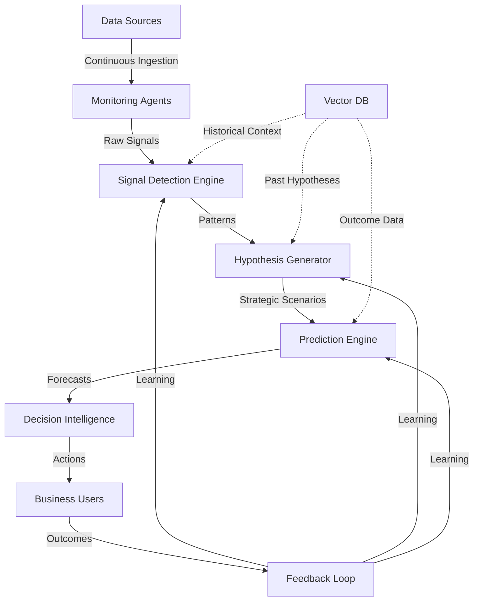

<div align="center">

# ACIA – Adaptive Competitive Intelligence Agent

### Predictive AI for Proactive Market Intelligence

*Anticipate competitor moves before they happen. Act with confidence.*

---

**Team:** Digital Alchemist | **Lead:** Cyril Polishetty

<!-- [](https://github.com)
[](https://github.com)
[](https://github.com) -->

</div>

---

## 📑 Table of Contents

- [Overview](#overview)
- [The Problem](#the-problem)
- [Our Solution](#our-solution)
- [Key Features](#key-features)
- [How It Works](#how-it-works)
- [Technology Stack](#technology-stack)
- [Unique Value Proposition](#unique-value-proposition)
- [Use Cases](#use-cases)
- [Getting Started](#getting-started)
- [Roadmap](#roadmap)
- [Contributing](#contributing)
- [License](#license)
- [Contact](#contact)

---

## 🎯 Overview

**ACIA (Adaptive Competitive Intelligence Agent)** is an AI-powered strategic intelligence platform that transforms how retail, e-commerce, and marketplace organizations understand and respond to competitive dynamics.

Unlike traditional monitoring tools that merely alert you to changes, ACIA **predicts competitor moves before they materialize**, provides strategic reasoning behind market shifts, and continuously learns from outcomes to improve its accuracy.

### Mission

Enable faster, proactive, and data-driven commercial decision-making through predictive competitive intelligence.

---

## 🔍 The Problem

Organizations face critical challenges in competitive intelligence:

| Challenge | Impact |
|-----------|--------|
| **Fragmented Data Sources** | Intelligence scattered across news, job postings, GitHub, pricing pages |
| **Manual Analysis** | Time-consuming, reactive, and prone to missing connections |
| **Weak Signal Blindness** | Early strategic indicators emerge months ahead but go unnoticed |
| **Alert Fatigue** | Existing tools generate noise without strategic context |
| **No Learning Mechanism** | Systems don't improve from past predictions and outcomes |

> **The Gap:** Early signals of competitor moves exist 3-6 months in advance, but organizations lack the tools to detect, connect, and act on them strategically.

---

## 💡 Our Solution

ACIA bridges the gap between data and strategic action through:

### Core Capabilities

```
┌─────────────────┐      ┌──────────────────┐      ┌─────────────────┐
│  Continuous     │──────▶│  AI Strategic    │──────▶│  Predictive     │
│  Multi-Source   │      │  Reasoning       │      │  Intelligence   │
│  Monitoring     │      │  & Hypothesis    │      │  & Action       │
└─────────────────┘      └──────────────────┘      └─────────────────┘
        │                         │                          │
        ▼                         ▼                          ▼
   Data Streams           Weak Signals              Strategic Insights
   • News APIs           • Pattern Analysis          • Predictions
   • Job Portals         • Hypothesis Gen           • Recommendations
   • GitHub              • Context Building         • Confidence Scores
   • Pricing Pages       • Strategic Linking        • Supporting Evidence
```

### What Makes ACIA Different

✅ **Strategic Reasoning** – Transforms weak signals into actionable intelligence  
✅ **Hypothesis-Driven** – Forms and evaluates strategic hypotheses, not just reports events  
✅ **Predictive First** – Anticipates future actions, not just summarizes past changes  
✅ **Self-Learning** – Improves accuracy through continuous outcome-based feedback  
✅ **Explainable AI** – Provides clear reasoning for why and what's coming next  

---

## 🚀 Key Features

### 1. **Intelligent Signal Detection**
- Multi-source data aggregation and normalization
- Pattern recognition across hiring, development activity, and market positioning
- Anomaly detection with contextual awareness

### 2. **Strategic Hypothesis Engine**
- Connects disparate signals into coherent strategic narratives
- Evaluates multiple competing hypotheses simultaneously
- Assigns confidence scores based on signal strength and historical patterns

### 3. **Predictive Analytics**
- Forecasts competitor actions with timing estimates
- Assesses potential market impact of predicted moves
- Provides probabilistic scenarios with uncertainty quantification

### 4. **Adaptive Learning System**
- Continuously validates predictions against real outcomes
- Adjusts signal weighting and pattern recognition dynamically
- Builds organizational knowledge base over time

### 5. **Decision Support**
- Generates actionable recommendations with supporting evidence
- Prioritizes insights by relevance and urgency
- Provides strategic context for business leaders

---

## ⚙️ How It Works

### System Architecture



### Process Flow

| Stage | Description | Output |
|-------|-------------|--------|
| **1. Monitoring** | Continuous data collection from news, jobs, GitHub, pricing | Structured data streams |
| **2. Signal Detection** | Identify anomalies and patterns (hiring spikes, code activity, price changes) | Weak signals with metadata |
| **3. Hypothesis Formation** | Connect signals to generate strategic scenarios | Ranked hypotheses with confidence |
| **4. Prediction** | Forecast competitor actions, timing, and impact | Predictive intelligence reports |
| **5. Learning** | Validate predictions against outcomes and refine models | Improved accuracy over time |
| **6. Action** | Deliver decision-ready insights to stakeholders | Strategic recommendations |

---

## 🛠️ Technology Stack

### AI & Machine Learning

| Technology | Purpose |
|------------|---------|
| **Large Language Models** | Strategic reasoning, hypothesis generation, natural language understanding |
| **Multi-Agent AI** | Specialized agents for monitoring, analysis, prediction, and validation |
| **RAG (Retrieval-Augmented Generation)** | Grounds insights in real-time data, reduces hallucinations |
| **Time-Series Analysis** | Trend detection and anomaly identification |

### Data Infrastructure

| Component | Implementation |
|-----------|----------------|
| **Vector Databases** | Long-term memory storage for signals, hypotheses, and outcomes |
| **Pattern Matching Engine** | Historical behavior analysis and similarity scoring |
| **Web Scraping Framework** | Automated data collection from multiple sources |
| **API Integration Layer** | Real-time data ingestion from news, jobs, and dev platforms |

### Learning & Adaptation

- **Reinforcement Learning** – Continuous improvement from prediction outcomes
- **Confidence Calibration** – Dynamic adjustment of certainty estimates
- **Signal Weighting** – Adaptive importance scoring based on historical accuracy

---

## 💎 Unique Value Proposition

<div align="center">

### Why ACIA Wins

| Traditional Tools | **ACIA** |
|-------------------|----------|
| Alert on changes | **Predict before changes** |
| Report what happened | **Explain why and what's next** |
| Static analysis | **Continuous learning** |
| Disconnected signals | **Strategic narratives** |
| Reactive | **Proactive** |

</div>

### Business Impact

- ⏱️ **3-6 months advance notice** on competitor strategic moves
- 📈 **Higher decision confidence** through explainable AI reasoning
- 🎯 **Resource optimization** by prioritizing high-impact threats/opportunities
- 🧠 **Institutional knowledge** captured and compounded over time

---

## 🎪 Use Cases

### Retail & E-Commerce
- Predict competitor pricing strategy changes
- Anticipate new product category launches
- Forecast market expansion moves

### Marketplace Platforms
- Detect seller acquisition initiatives
- Identify feature development priorities
- Monitor competitive positioning shifts

### Strategic Planning
- Scenario planning and war-gaming
- M&A target identification
- Partnership opportunity detection

---

## 🏁 Getting Started

### Prerequisites

```bash
- Python 3.9+
- API keys for data sources (news, jobs, GitHub)
- Vector database setup (Pinecone/Weaviate/Qdrant)
- LLM access (OpenAI/Anthropic/Azure OpenAI)
```

### Quick Start

```bash
# Clone the repository
git clone https://github.com/your-org/acia.git

# Install dependencies
pip install -r requirements.txt

# Configure environment
cp .env.example .env
# Edit .env with your API keys

# Initialize the system
python scripts/init_system.py

# Start monitoring
python main.py --mode monitor

# Run analysis
python main.py --mode analyze
```

### Configuration

Customize ACIA for your organization:
- Define competitor list and monitoring scope
- Set alert thresholds and signal sensitivity
- Configure data source priorities
- Customize hypothesis templates

---

## 🗺️ Roadmap

### Phase 1 (Current)
- ✅ Core monitoring and signal detection
- ✅ Hypothesis generation framework
- ✅ Basic prediction engine
- ✅ Feedback loop implementation

### Phase 2 (Q2 2026)
- 🔄 Integration with internal enterprise data (CRM, ERP)
- 🔄 Enhanced scenario simulation capabilities
- 🔄 Interactive strategy comparison dashboards
- 🔄 Mobile app for real-time alerts

### Phase 3 (Q3-Q4 2026)
- 📅 Industry-specific intelligence models
- 📅 Collaborative intelligence sharing (anonymized)
- 📅 Advanced visualization and reporting
- 📅 API marketplace integration

### Future Vision
- Global competitive intelligence network
- Predictive accuracy benchmarking
- AI-driven strategy recommendation engine
- Real-time market simulation

---

## 🤝 Contributing

We welcome contributions from the community! Please see our [Contributing Guidelines](CONTRIBUTING.md) for details on:

- Code of Conduct
- Development workflow
- Submission process
- Testing requirements

---

## 📄 License

This project is developed for the **AI for Retail, Commerce & Market Intelligence Hackathon**.

*License terms to be determined based on project direction and stakeholder decisions.*

---

## 📞 Contact

**Team Digital Alchemist**

- **Project Lead:** Cyril Polishetty
- **Email:** [contact@digitalalchemist.team](mailto:contact@digitalalchemist.team)
- **GitHub:** [@digital-alchemist](https://github.com/digital-alchemist)

---

<div align="center">

### 🌟 Hackathon Alignment

ACIA demonstrates how AI can transform competitive intelligence from **reactive monitoring to proactive strategic advantage**, directly addressing the hackathon's focus on enhancing decision-making, operational efficiency, and competitive positioning in retail and commerce.

---

**Built with ❤️ by Team Digital Alchemist**

*Empowering organizations to act earlier, smarter, and with greater confidence.*

</div>
