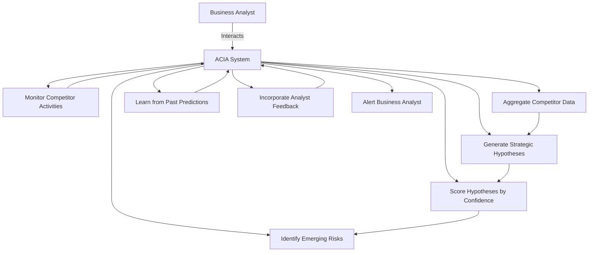

<div align="center">

# ACIA – Autonomous Competitive Intelligence Agent 

### Predictive AI for Proactive Market Intelligence

*Anticipate competitor moves before they happen. Act with confidence.*

---

**Team:** Digital Alchemist

**Team Members:**
- **Cyril Polishetty** - Team Lead
- **Cholleti Sucheer** - AI Engineer & Backend Developer
- **Jagati Nikhil Ram Kumar** - AI Engineer & Frontend Developer
- **Tuniki Vivek** - AI Engineer & Backend Developer

<!-- [](https://github.com)
[](https://github.com)
[](https://github.com) -->

</div>

---

## 📑 Table of Contents

- [Overview](#overview)
- [The Problem](#the-problem)
- [Our Solution](#our-solution)
- [Key Features](#key-features)
- [How It Works](#how-it-works)
- [Technology Stack](#technology-stack)
- [Unique Value Proposition](#unique-value-proposition)
- [Use Cases](#use-cases)
- [Getting Started](#getting-started)
- [Roadmap](#roadmap)
- [Contributing](#contributing)
- [License](#license)
- [Contact](#contact)

---

## 🎯 Overview

**ACIA (Adaptive Competitive Intelligence Agent)** is an AI-powered strategic intelligence platform that transforms how retail, e-commerce, and marketplace organizations understand and respond to competitive dynamics.

Unlike traditional monitoring tools that merely alert you to changes, ACIA **predicts competitor moves before they materialize**, provides strategic reasoning behind market shifts, and continuously learns from outcomes to improve its accuracy.

### 🎯 Objective

> *"ACIA is designed for retail, e-commerce, and marketplace companies to proactively anticipate competitor strategies, pricing moves, and market shifts, enabling faster and more informed commercial decision-making."*

### 💪 Motivation

By automating competitive intelligence, ACIA helps companies:
- **Make proactive, data-driven decisions** instead of reactive responses
- **Reduce missed opportunities** by catching early weak signals
- **Learn from previous predictions** to continuously improve future accuracy
- **Transform strategic planning** from guesswork to evidence-based forecasting

---

## 🔍 The Problem

### Companies Today Struggle to React Proactively to Competitors:

🔴 **Manual Tracking**  
They track competitors manually via news, hiring updates, GitHub changes, and pricing pages.

🔴 **Missed Early Signals**  
Weak signals of strategic moves often appear **months before actual announcements**, but are missed.

🔴 **Limited Tools**  
Existing tools **only alert or track changes** without providing actionable intelligence or learning from past outcomes.

---

### The Critical Challenges:

| Challenge | Impact |
|-----------|--------|
| **Fragmented Data Sources** | Intelligence scattered across news, job portings, GitHub, pricing pages |
| **Manual Analysis** | Time-consuming, reactive, and prone to missing connections |
| **Weak Signal Blindness** | Early strategic indicators emerge months ahead but go unnoticed |
| **Alert Fatigue** | Existing tools generate noise without strategic context |
| **No Learning Mechanism** | Systems don't improve from past predictions and outcomes |

> **The Gap:** Early signals of competitor moves exist 3-6 months in advance, but organizations lack the tools to detect, connect, and act on them strategically.

---

## 💡 Our Solution

ACIA bridges the gap between data and strategic action through a **4-stage dynamic architecture**:

### Core Capabilities

<div align="center">

**Modular Data Perception** → **Smart Normalization** → **Reasoning Core** → **Memory & Learning**

</div>

| Stage | Key Components | Strategic Value |
|-------|----------------|-----------------|
| **🔍 Data Perception** | 5 specialized agents (GitHub, Hiring, Website, News, Sentiment) | Comprehensive competitive coverage |
| **⚙️ Normalization** | Signal scoring, enrichment, unified JSON format | Consistent, actionable data |
| **🧠 Reasoning Core** | Hypothesis generation, adversarial critique, evidence validation | Strategic narratives with high confidence |
| **💾 Memory & Learning** | Long-term storage, semantic knowledge, feedback loops | Continuously improving accuracy |

### 🚀 How ACIA is Different

<div align="center">

| Traditional Tools | **ACIA Approach** |
|-------------------|-------------------|
| Alert on changes | **Strategic reasoning** beyond alerts |
| Isolated events | **Connects multiple weak signals** into meaningful insights |
| Report what happened | **Forms hypotheses** instead of reporting isolated events |
| Static accuracy | **Learns from past predictions** to improve accuracy over time |
| Past-focused | **Focuses on future actions**, not past changes |

</div>

**Key Differentiators:**

✅ **Strategic Reasoning** – Transforms weak signals into actionable intelligence  
✅ **Hypothesis-Driven** – Forms and evaluates strategic hypotheses, not just reports events  
✅ **Predictive First** – Anticipates future actions, not just summarizes past changes  
✅ **Self-Learning** – Improves accuracy through continuous outcome-based feedback  
✅ **Explainable AI** – Provides clear reasoning for why and what's coming next  
✅ **Adversarial Validation** – Multi-agent critique ensures robust predictions

---

### 🎯 How ACIA Solves the Problem

1. **Continuously monitors** competitors across multiple data sources
2. **Detects early** strategic signals and patterns  
3. **Generates and evaluates** strategic hypotheses
4. **Predicts** competitors' next moves, timing, and impact
5. **Uses feedback and memory** to refine future predictions
6. **Produces actionable recommendations** for decision-makers  

---

## 🚀 Key Features

### 1. **Modular Data Perception Layer**
- **5 Specialized Monitoring Agents**: GitHub, Hiring, Website, News/Social, Sentiment tracking
- **Extensible Architecture**: Easy addition of new data sources and monitoring agents
- **Real-time Signal Collection**: Continuous monitoring with automated anomaly detection
- **Multi-dimensional Coverage**: Technical, organizational, market, and sentiment signals

### 2. **Smart Normalization & Structuring**
- **Unified Data Model**: Standardized JSON-based signal representation
- **Signal Scoring System**: 0.0-1.0 strength metrics for prioritization
- **Context Enrichment**: Automatic addition of historical and relational context
- **Quality Filtering**: Noise reduction and relevance optimization

### 3. **Reasoning Core with Adversarial Validation**
- **Multi-Hypothesis Generation**: Creates competing strategic interpretations
- **Critique Agent System**: Adversarial evaluation for robustness
- **Confidence Calibration**: Evidence-based confidence scoring
- **Strategic Narrative Building**: Connects signals into coherent stories
- **Contradiction Resolution**: Identifies and resolves conflicting signals

### 4. **Memory & Continuous Learning System**
- **Long-Term Memory Storage**: Signals, outcomes, and real-world validation results
- **Semantic Knowledge Graph**: Dynamic competitor behavior modeling
- **Outcome-Based Learning**: Automatic weight adjustment from prediction accuracy
- **Pattern Recognition**: Historical similarity matching and trend analysis
- **Predictive Accuracy Tracking**: Self-monitoring and improvement metrics

### 5. **Proactive Intelligence Delivery**
- **Actionable Recommendations**: Decision-ready insights with supporting evidence
- **Timing Predictions**: When competitor moves are likely to materialize
- **Impact Assessment**: Quantified business impact scenarios
- **Early Warning System**: 3-6 month advance strategic alerts
- **Explainable Outputs**: Full reasoning chain and evidence trail

---

## ⚙️ How It Works

### System Architecture

ACIA operates through a **4-stage dynamic pipeline** that transforms raw competitive data into strategic intelligence:

```mermaid
graph LR
    subgraph Stage1["🔍 Stage 1: Modular Data Perception"]
        A1[GitHub Agent<br/>Commit Velocity<br/>Library Shifts]
        A2[Hiring Agent<br/>Job Role Changes<br/>Hiring Patterns]
        A3[Website Agent<br/>DOM/Algorithms<br/>Pricing Changes]
        A4[News/Social Agent<br/>PR Mentions<br/>Competitive Signals]
        A5[Sentiment Spike<br/>Public Comment<br/>PR Volume]
    end
    
    subgraph Stage2["⚙️ Stage 2: Smart Normalization"]
        B1[Signal Normalization<br/>& Enrichment Engine]
        B2[Unified Data<br/>JSON Scoring]
        B3[Signal Scoring Output<br/>type, company, strength]
    end
    
    subgraph Stage3["🧠 Stage 3: Reasoning Core"]
        C1[Hypothesis Generator<br/>Multiple Hypotheses<br/>+ Confidence Scores]
        C2[Hypothesis & Critique Agent<br/>Evaluates Contradictions<br/>Assigns Critique Scores]
        C3[Adversarial Dialogue Loop]
        C4[Evidence Validator<br/>Prediction vs Reality]
    end
    
    subgraph Stage4["💾 Stage 4: Memory & Learning"]
        D1[Long-Term Memory<br/>Signals, Outcomes, Reality]
        D2[Semantic Knowledge<br/>Competitor Insights]
        D3[Feedback & Learning<br/>Over Time]
        D4[Proactive Insights<br/>Strategic Output]
    end
    
    Stage1 -->|Raw Signals| Stage2
    Stage2 -->|Normalized Data| Stage3
    Stage3 -->|Validated Hypotheses| Stage4
    Stage4 -->|Insights| E[Business Users]
    E -->|Outcomes| Stage4
    Stage4 -.->|Continuous Learning| Stage2
    Stage4 -.->|Continuous Learning| Stage3
```



### Detailed Process Flow

#### **Stage 1: Modular Data Perception** 🔍
Extensible multi-agent system for continuous competitive monitoring:

| Agent | Monitors | Key Signals |
|-------|----------|-------------|
| **GitHub Agent** | Repository activity | Commit velocity, library shifts, new features |
| **Hiring Agent** | Job postings | Role changes, hiring patterns, team expansion |
| **Website Agent** | Competitor sites | DOM changes, algorithm updates, pricing shifts |
| **News/Social Agent** | Media & social | PR mentions, announcements, competitive signals |
| **Sentiment Spike** | Public sentiment | Comment volume, sentiment shifts, PR events |

#### **Stage 2: Smart Normalization & Structuring** ⚙️
Transforms disparate signals into unified, scored intelligence:

- **Signal Normalization Engine**: Standardizes data formats and enriches context
- **Unified Data Model**: JSON-based scoring system for consistent signal representation
- **Signal Scoring**: Each signal gets `type`, `company`, and `strength` (0.0-1.0) attributes

**Example Output:**
```json
{
  "type": "price_change",
  "company": "Competitor X",
  "strength": 0.7,
  "timestamp": "2026-02-15T10:30:00Z",
  "context": "15% reduction in premium tier pricing"
}
```

#### **Stage 3: Reasoning Core Analysis & Validation** 🧠
Multi-agent strategic reasoning with adversarial critique:

| Component | Function | Output |
|-----------|----------|--------|
| **Hypothesis Generator** | Creates multiple strategic hypotheses from signals | Ranked hypotheses with confidence scores |
| **Hypothesis & Critique Agent** | Evaluates contradictions and challenges assumptions | Critique scores and refined hypotheses |
| **Adversarial Dialogue Loop** | Debates competing interpretations | Robust strategic narratives |
| **Evidence Validator** | Compares predictions to reality | Validated insights with proof |

#### **Stage 4: Memory & Continuous Learning** 💾
Self-improving system with long-term strategic memory:

- **Long-Term Memory**: Stores signals, outcomes, and real-world results
- **Semantic Knowledge Base**: Maintains competitor profiles and behavioral patterns
- **Feedback Learning**: Adjusts weights and confidence based on prediction accuracy
- **Proactive Insights Generation**: Delivers actionable strategic recommendations

**Key Improvement**: System accuracy improves over time through continuous outcome validation

---

## 🛠️ Technology Stack

### Core Technologies Used in ACIA

#### **🤖 Large Language Models (LLMs)**
- **Strategic Reasoning**: Hypothesis generation and strategic explanation
- **Natural Language Understanding**: Processes news, reports, and job postings
- **Context Analysis**: Interprets unstructured competitive data
- **Explainability**: Generates human-readable insights with evidence chains

#### **🔄 Multi-Agent AI Architecture**
- **Separate Specialized Agents**: Dedicated agents for monitoring, analysis, prediction, and validation
- **Parallel Reasoning**: Multiple agents work simultaneously for faster insights
- **Strategy Comparison**: Competing hypotheses evaluated by different agent perspectives
- **Modular & Extensible**: Easy addition of new agents and data sources

#### **🔍 Retrieval-Augmented Generation (RAG)**
- **Real-Time Grounding**: Predictions anchored in current competitor data
- **Hallucination Reduction**: Improves accuracy and trustworthiness
- **Contextual Retrieval**: Pulls relevant historical patterns and signals
- **Evidence-Based Outputs**: Every insight backed by actual data points

#### **💾 Vector Databases**
- **Long-Term Memory**: Stores past signals, hypotheses, and outcomes
- **Pattern Matching**: Identifies similarities across historical competitor behavior
- **Semantic Search**: Finds relevant patterns even with different wording
- **Scalable Storage**: Efficiently handles growing intelligence database

#### **📊 Time-Series & Pattern Analysis**
- **Trend Detection**: Identifies patterns in hiring, product changes, and activity spikes
- **Weak Signal Identification**: Catches early indicators before public announcements
- **Anomaly Detection**: Spots unusual behavior that signals strategic shifts
- **Temporal Correlation**: Links signals across time for predictive insights

#### **🔄 Feedback Learning Loop**
- **Prediction Validation**: Compares forecasts with actual outcomes
- **Dynamic Adjustment**: Automatically updates signal importance and weights
- **Confidence Calibration**: Refines prediction confidence based on accuracy history
- **Continuous Improvement**: System gets smarter with every validated prediction

#### **🌐 Web Scraping & API Integration**
- **Continuous Data Ingestion**: Real-time collection from news, GitHub, pricing pages, job portals
- **Multi-Source Integration**: Unified pipeline for diverse data sources
- **Rate Limiting & Ethics**: Respectful scraping within API limits
- **Data Normalization**: Transforms raw data into structured intelligence

### Learning & Adaptation

- **Feedback Learning Loop** – Compares predictions with actual outcomes and dynamically adjusts signal importance
- **Confidence Calibration** – Dynamic adjustment of certainty estimates based on historical accuracy
- **Signal Weighting** – Adaptive importance scoring that improves over time
- **Outcome Validation** – Continuous tracking of prediction accuracy against real-world results

---

## 🎯 Hackathon Approach & Technical Implementation

### Our Technical Strategy

ACIA leverages cutting-edge AI technologies to deliver predictive competitive intelligence:

**🤖 Large Language Models (LLMs)**
- Analyze unstructured competitor data (news, reports, job postings)
- Generate strategic insights through reasoning and hypothesis formation
- Provide natural language explanations for every prediction

**🔀 Agent-Based AI Architecture**  
- Separate specialized agents for monitoring, analysis, prediction, and validation
- Enables parallel reasoning and strategy comparison
- Modular design allows easy extension with new data sources

**🔍 Retrieval-Augmented Generation (RAG)**  
- Grounds insights in real-time competitor signals
- Reduces hallucinations and improves trustworthiness
- Connects current signals with historical patterns

**💾 Memory Layer (Vector Database)**  
- Stores past signals, predictions, and actual outcomes
- Enables pattern matching across historical competitor behavior
- Powers long-term learning and accuracy improvement

**📊 Trend & Weak-Signal Detection**  
- Time-series analysis on hiring, GitHub activity, news, and pricing changes
- Identifies early weak signals before competitors make public announcements
- Anomaly detection with contextual awareness

**🔄 Feedback Loop Integration**  
- Compares predictions with real outcomes
- Continuously improves signal weights and confidence scores
- Self-correcting system that gets smarter with every prediction

**📖 Explainable AI Outputs**  
- Every prediction includes evidence-based reasoning
- Full transparency into signal sources and confidence calculation
- Enables business users to understand and trust the insights

### Implementation Highlights

```python
# Example: ACIA Prediction Flow
1. Data Collection → Multi-agent monitoring (GitHub, Jobs, News, Pricing)
2. Normalization → Unified JSON schema with signal scoring (0.0-1.0)
3. Hypothesis Generation → LLM creates multiple strategic scenarios
4. Adversarial Critique → Competing agents challenge and refine hypotheses
5. Confidence Scoring → Evidence-based probability assessment
6. Prediction Output → Actionable insight with timing and impact
7. Outcome Tracking → Validation against reality
8. Learning Update → Adjust weights for future predictions
```

---

## 💎 Unique Selling Proposition (USP)

<div align="center">

### 🏆 Why ACIA Wins

</div>

**Core USP Elements:**

🎯 **Predictive, Self-Learning Competitive Intelligence System**  
First platform that not only monitors but actively predicts and learns from outcomes

🧠 **Explains *Why* and *What Comes Next***  
Provides strategic context: why a move is happening and what's likely to happen next

📈 **Improves with Usage Through Outcome-Based Learning**  
Gets smarter over time by validating predictions against real outcomes

⚡ **Delivers Strategy-Level Insights, Not Raw Data or Alerts**  
Transforms data into decision-ready strategic intelligence

---

### Competitive Advantage

| Traditional Tools | **ACIA** |
|-------------------|----------|
| Alert on changes | **Predict before changes** |
| Report what happened | **Explain why and what's next** |
| Static analysis | **Continuous learning** |
| Disconnected signals | **Strategic narratives** |
| Reactive | **Proactive** |

---

### Business Impact

- ⏱️ **3-6 months advance notice** on competitor strategic moves
- 📈 **Higher decision confidence** through explainable AI reasoning
- 🎯 **Resource optimization** by prioritizing high-impact threats/opportunities
- 🧠 **Institutional knowledge** captured and compounded over time
- 💡 **Reduced missed opportunities** through early signal detection
- 🚀 **Faster strategic responses** with prediction timing and impact analysis

---

## 🎪 Use Cases

### Business Analyst Interaction Flow

ACIA enables business analysts to:



### Industry Applications

#### Retail & E-Commerce
- **Pricing Intelligence**: Predict competitor pricing strategy changes before they happen
- **Product Strategy**: Anticipate new product category launches and feature releases
- **Market Expansion**: Forecast geographic or demographic expansion moves
- **Promotional Tactics**: Detect upcoming promotional campaigns and seasonal strategies

#### Marketplace Platforms
- **Seller Acquisition**: Detect competitor seller acquisition initiatives and incentive programs
- **Feature Development**: Identify competitor feature development priorities through GitHub activity
- **Competitive Positioning**: Monitor strategic positioning shifts and messaging changes
- **Platform Changes**: Predict commission structure or policy modifications

#### Strategic Planning & Corporate Intelligence
- **Scenario Planning**: War-gaming competitor responses to your strategic moves
- **M&A Intelligence**: Identify potential acquisition targets or threats
- **Partnership Detection**: Spot emerging partnership opportunities or competitive alliances
- **Talent Strategy**: Understand competitor hiring patterns and capability building

---

## 🏁 Getting Started

### Prerequisites

```bash
- Python 3.9+
- API keys for data sources (news, jobs, GitHub)
- Vector database setup (Pinecone/Weaviate/Qdrant)
- LLM access (OpenAI/Anthropic/Azure OpenAI)
```

### Quick Start

```bash
# Clone the repository
git clone https://github.com/Polisetty-Cyril/AI-for-Retail-Commerce-and-Market-Intelligence.git
cd AI-for-Retail-Commerce-and-Market-Intelligence

# Install dependencies
pip install -r requirements.txt

# Configure environment
cp .env.example .env
# Edit .env with your API keys

# Initialize the system
python scripts/init_system.py

# Start monitoring
python main.py --mode monitor

# Run analysis
python main.py --mode analyze
```

### Configuration

Customize ACIA for your organization:
- Define competitor list and monitoring scope
- Set alert thresholds and signal sensitivity
- Configure data source priorities
- Customize hypothesis templates

---

## 🗺️ Roadmap

### Phase 1 (Current)
- ✅ Core monitoring and signal detection
- ✅ Hypothesis generation framework
- ✅ Basic prediction engine
- ✅ Feedback loop implementation

### Phase 2 (Q2 2026)
- 🔄 Integration with internal enterprise data (CRM, ERP)
- 🔄 Enhanced scenario simulation capabilities
- 🔄 Interactive strategy comparison dashboards
- 🔄 Mobile app for real-time alerts

### Phase 3 (Q3-Q4 2026)
- 📅 Industry-specific intelligence models
- 📅 Collaborative intelligence sharing (anonymized)
- 📅 Advanced visualization and reporting
- 📅 API marketplace integration

### Future Vision
- Global competitive intelligence network
- Predictive accuracy benchmarking
- AI-driven strategy recommendation engine
- Real-time market simulation

---

## 🤝 Contributing

We welcome contributions from the community! Please see our [Contributing Guidelines](CONTRIBUTING.md) for details on:

- Code of Conduct
- Development workflow
- Submission process
- Testing requirements

---

## 📄 License

This project is developed for the **AI for Retail, Commerce & Market Intelligence Hackathon**.

*License terms to be determined based on project direction and stakeholder decisions.*

---

## 📞 Contact

**Team Digital Alchemist**

- **Project Lead:** Cyril Polishetty
- **Email:** [cyrilp4107@gmail.com](mailto:cyrilp4107@gmail.com)
- **GitHub:** [@Polisetty-Cyril](https://github.com/Polisetty-Cyril)
- **Repository:** [AI-for-Retail-Commerce-and-Market-Intelligence](https://github.com/Polisetty-Cyril/AI-for-Retail-Commerce-and-Market-Intelligence)

---

<div align="center">

### 🌟 Hackathon Alignment

ACIA demonstrates how AI can transform competitive intelligence from **reactive monitoring to proactive strategic advantage**, directly addressing the hackathon's focus on enhancing decision-making, operational efficiency, and competitive positioning in retail and commerce.

---

**Built with ❤️ by Team Digital Alchemist**

*Empowering organizations to act earlier, smarter, and with greater confidence.*

</div>
